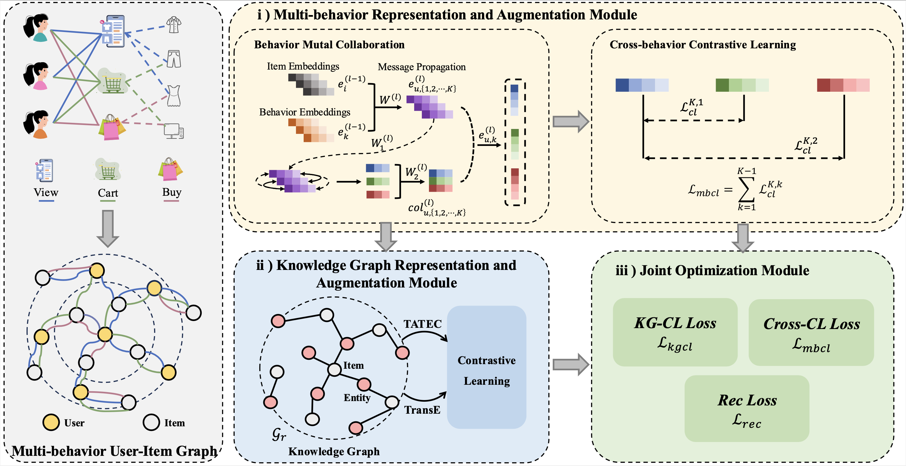

# Knowledge Graph-Guided Cross-Behavior Contrastive Learning for Enhanced Multi-Behavior Recommendation

This is the official Pytorch implementation for our paper: "Knowledge Graph-Guided Cross-Behavior Contrastive Learning for Enhanced Multi-Behavior Recommendation
"

## Overview

<p align="center">
  
  <br>
  <b>Figure 1.</b> KG-Mber Model Framework.
</p>

## Quick-Start

Run the KG-Mber model on the Retail-Rocket dataset by default.

```bash
python main.py
```

Typically, this example takes less than one minute. It will obtain the following output:

```
Dataset name: retail_rocket
The number of users: 2174
The number of items: 30113
The behavior ratings: [75374, 12456, 9551]
The number of ratings: 97381
Average actions of users: 44.79
Average actions of items: 3.23
The density of the dataset: 0.001488
The sparsity of the dataset: 99.851249%
user:2174, item:30113, entity:27821
already load adj matrix 0.031651973724365234
already load pre adj matrix
use the pre adjcency matrix
transE_loss: 0.701--TATEC_loss: 0.698
Epoch 0 [7.5s]: train==[29878.52954=-0.00016 + 54.15264 + 699.31869 + 29125.05811]
transE_loss: 0.695--TATEC_loss: 0.695

...

Early stopping is trigger at step: 10 log:0.08463661453541885
Best Iter=[84]@[2.6h]	recall=[0.0915	0.1081	0.1362], ndcg=[0.0517	0.0559	0.0616]
```

