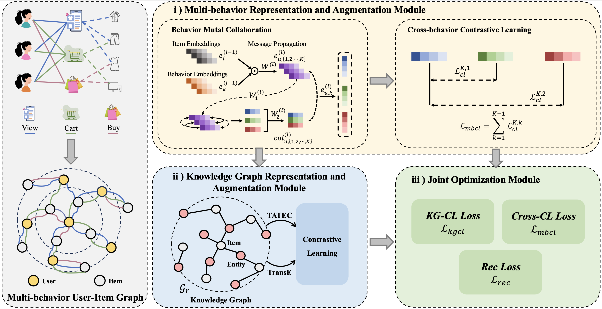

# KG-Mber: Knowledge Graph-Guided Cross-Behavior Contrastive Learning for Enhanced Multi-Behavior Recommendation

[](./LICENSE)
[](https://www.python.org/downloads/release/python-390/)
[](https://github.com/psf/black)

This is the official Pytorch implementation for our paper: "Knowledge Graph-Guided Cross-Behavior Contrastive Learning for Enhanced Multi-Behavior Recommendation".

## Overview

Our KG-Mber introduces a behavior mutual collaboration mechanism designed to enhance cross-behavior contrastive learning, thereby facilitating improved multi-behavior embedding representations. Additionally, we employs a user-item interaction patterns to optimize data augmentation in knowledge graph-based contrastive learning, facilitating a more effective transfer of external knowledge between users and items. Furthermore, a non-sampling strategy is employed to provide more informative contexts within user preference learning.

<p align="center">
  
  <br>
  The model architecture of the proposed KG-Mber framework.
</p>


## Datasets 

The dataset is located in `./dataset`, for example, Retail-Rocket, in this repository due to GitHub's file storage limitations.

## Quick-Start

Please run the following command to train the KG-Mber model on the Retail-Rocket dataset.

```bash
python main.py 
```

Typically, the training and evaluation process require less than three hours to complete and yield the following output:

```
Dataset name: retail_rocket
The number of users: 2174
The number of items: 30113
The behavior ratings: [75374, 12456, 9551]
The number of ratings: 97381
Average actions of users: 44.79
Average actions of items: 3.23
The density of the dataset: 0.001488
The sparsity of the dataset: 99.851249%
user:2174, item:30113, entity:27821
already load adj matrix 0.031651973724365234
already load pre adj matrix
use the pre adjcency matrix
transE_loss: 0.701--TATEC_loss: 0.698

Epoch 0 [7.5s]: train==[29878.52954=-0.00016 + 54.15264 + 699.31869 + 29125.05811]
transE_loss: 0.695--TATEC_loss: 0.695
...
Early stopping is trigger at step: 10 log:0.08463661453541885

Best Iter=[84]@[2.6h]	recall=[0.0915	0.1081	0.1362], ndcg=[0.0517	0.0559	0.0616]
```

## License

All data and code in this project are licensed under the [Apache License](./LICENSE).